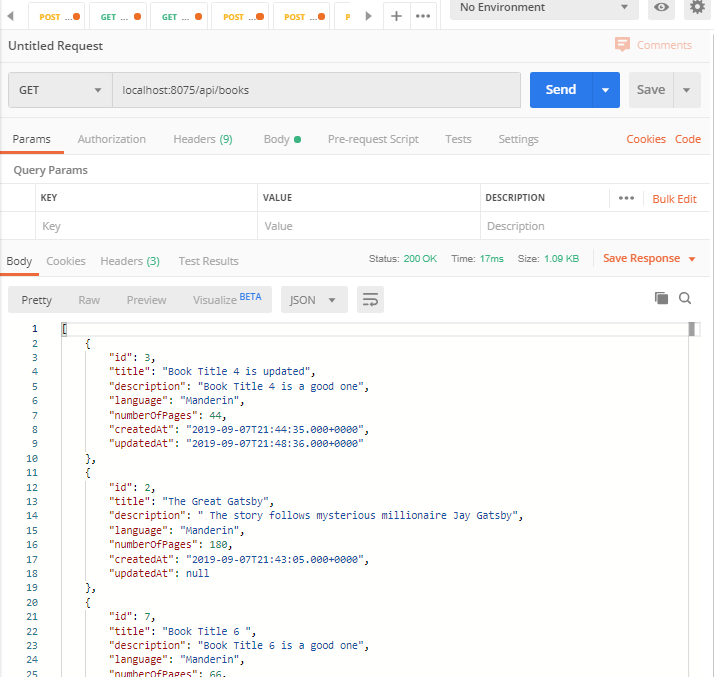
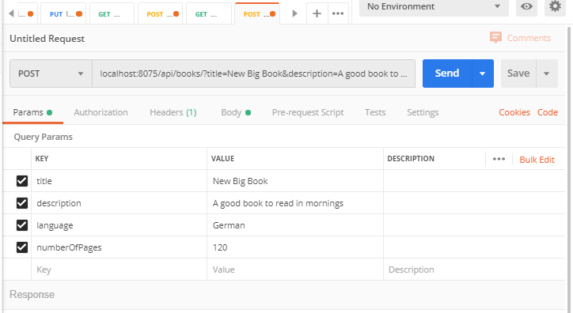
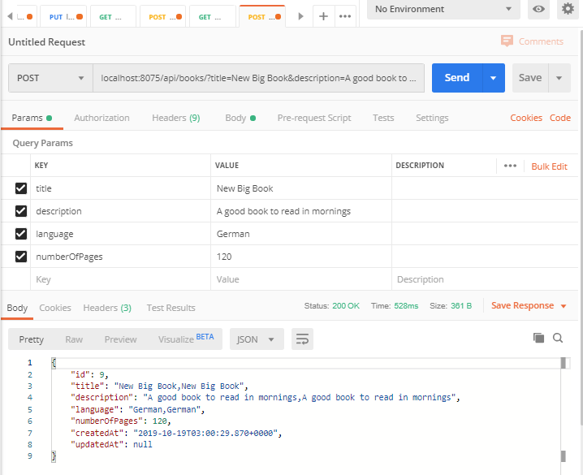
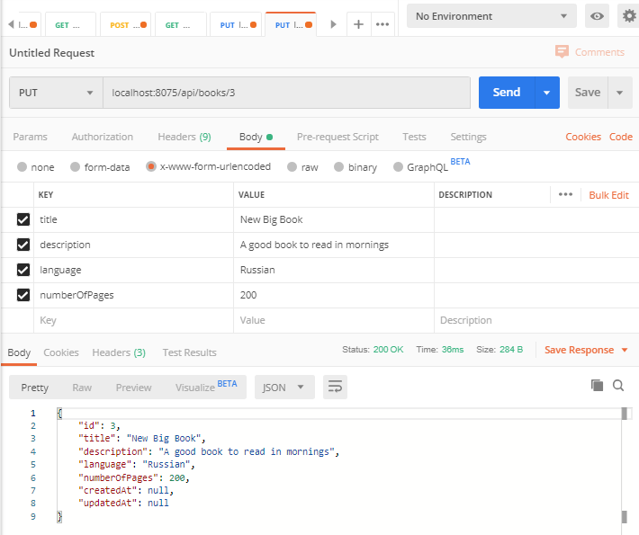
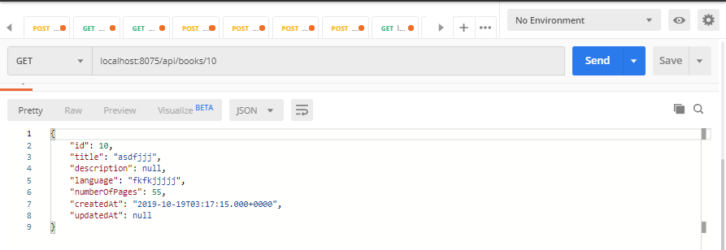
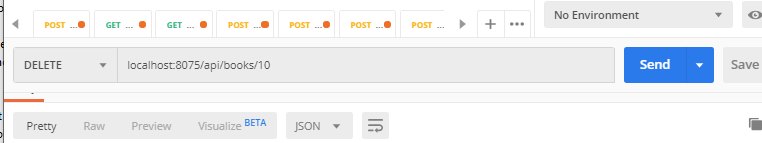

# REST API as Books

A simple RESTful API service that is a demo and reference.  Structure is just a list of books with a few variables/properties.  Books and their properties can be added, deleted, and updated via API controller.

# Installation
This is a Maven/Spring Boot project with default WAR settings

Spring Boot will populate your MySQL file.  Just create the file and if different, change in the application.properties file

[comment]: # (mvn spring-boot:run)

# Usage

Postman is a handy way to verify the API interface and screnshots are included below 

# Selected Screenshots:
Get all Books from API using GET and hostport/api/books

Add another book using POST hostport/api/books/?title=New Big Book&description=A good book to read in mornings&language=German&numberOfPages=120

Sent:  
 

Return:

 

Update/Edit German to Russian using PUT hostport/api/books/3 and title=New+Big+Book&description=A+good+book+to+read+in+mornings&language=Russian&numberOfPages=200

  

Viewed a book worthy of deletion using: GET localhost:8075/api/books/10
 

Deleting that book using: DELETE localhost:8075/api/books/10

# Potential Future Features:
None planned

